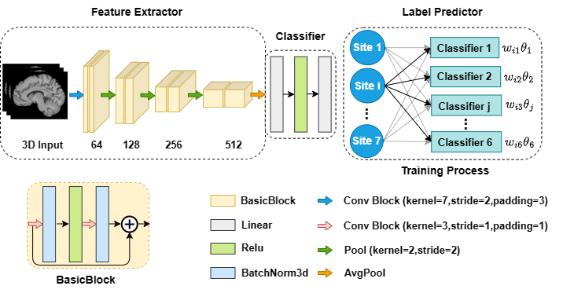

# DomainKnowledge4AD

This release contains model structure code and model test code.

## Background

We proposed a novel end-to-end domain-knowledge constrained neural network for automatic and reproducible diagnosis of AD using sMRI images.

Our framework mitigates the impact of domain-shifting and improves model performance on multi-site datasets.

Our framework is shown below:



## Usage

### 1. Environment

Code running in Python 3.9 and torch 1.12 with other dependencies (such as SimpleITK). Use ```pip install -r dependency.txt``` to install all the required packages.

### 2. Data

Our Model is trained using MCAD dataset, which consists of data from seven different sites. This release dose not contain training/testing data, but you can see the model's performance on MCAD in ```validtae.ipynb```. 

The function ```get_data(path, mcad_info)``` in ```DataSet.py``` is used to get image path, image label and image site information. If you want to try the test code on your own dataset, this function in our release may not suitable for your dataset. Please rewrite this function to get image path, image label and image site information on your own dataset.

### 3. Test code

We show the performance of our trained model on MCAD dataset in ```validate.ipynb```. There are 7 trained model in the ```model``` folder and each model is trained by 6 sites' data and test by one site's data. 

For example, ```chan=1-512 domain=F testsite=0 best_network.pth``` means this model is trained by site 1 to site 6 and test by site 0. 

The model performance(prediction accuracy at different sites) in ```validate.ipynb``` is shown below:

|  model  | site 0 | site 1 | site 2 | site 3 | site 4 | site 5 | site 6 |
| :-----: | :----: | :----: | :----: | :----: | :----: | :----: | :----: |
| model 0 |  0.87  |  1.0   |  0.97  |  0.85  |  1.0   |  0.98  |  0.96  |
| model 1 |  1.0   |  0.91  |  1.0   |  0.95  |  1.0   |  1.0   |  1.0   |
| model 2 |  1.0   |  1.0   |  0.77  |  0.80  |  0.99  |  0.98  |  0.98  |
| model 3 |  1.0   |  1.0   |  1.0   |  0.75  |  1.0   |  1.0   |  0.98  |
| model 4 |  1.0   |  1.0   |  0.92  |  0.84  |  0.91  |  0.95  |  0.98  |
| model 5 |  0.95  |  1.0   |  0.92  |  0.74  |  0.99  |  0.91  |  0.96  |
| model 6 |  1.0   |  1.0   |  0.92  |  0.75  |  0.99  |  0.96  |  0.89  |

Which model 0 means the model trained by site 1 to site 6 and test by site 0 (trained without site 0).


